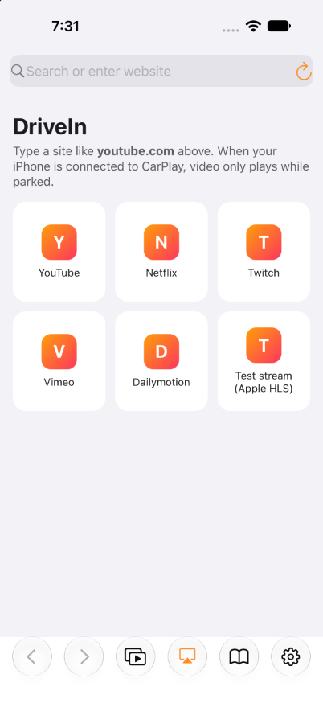
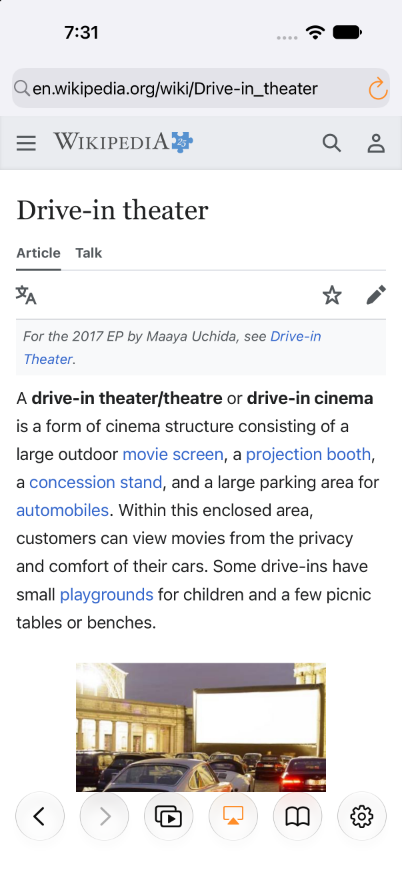
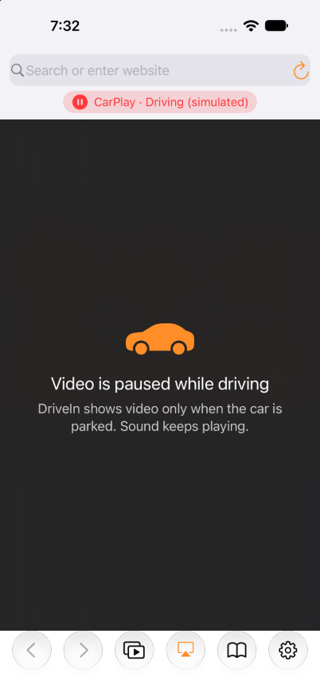
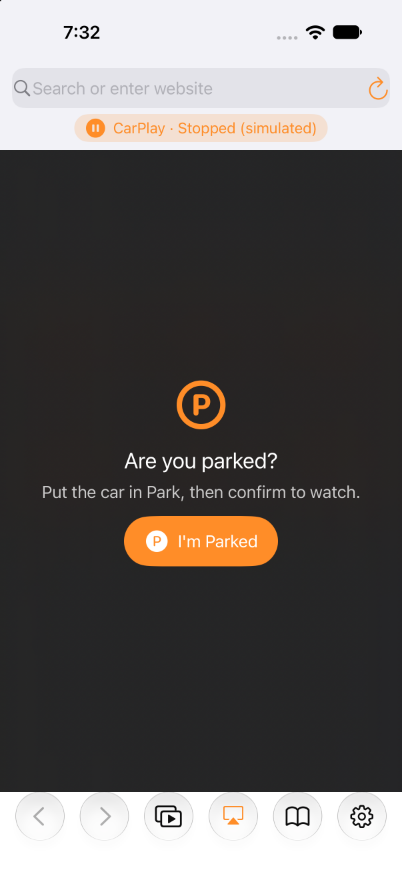

# DriveIn: a browser and parked-only video player for CarPlay (iOS 27)


DriveIn is an iPhone browser built around one rule: **while the iPhone is connected to
CarPlay (wired or wireless), video only plays when the car is parked.** It's modelled on
[APTV's CarPlay feature](https://aptv.app/carplay): you browse on the car screen, and the
video plays on the car screen.

It ships as an unsigned **`DriveIn.ipa`** built by GitHub Actions, which you install with
**Sideloadly** from your PC.

> **Read this first.** iOS only shows an app on the CarPlay screen when it's signed with
> a CarPlay entitlement. Apple grants those to paid developer accounts that apply, one
> category at a time. A free Apple ID can't sign them, so **with Sideloadly and a free
> Apple ID, DriveIn will not appear on your car's screen.** Neither the official iOS 27
> path nor any workaround gets around this on iOS 27. Here's what does work with a free
> Apple ID:
>
> - the full browser and video player on the iPhone, with the parked-only gate;
> - **AirPlay "video in car"**: video on the car display, if your car supports Apple's
>   iOS 26+ feature (only when parked; needs no entitlement);
> - a **Live Activity on the CarPlay Dashboard** (iOS 26+) that shows whether video is
>   allowed and what's playing. Its **I'm Parked** and play/pause buttons work on the iPhone
>   Lock Screen; Apple doesn't say whether the car screen passes taps to Live Activities;
> - sound plus playback controls in CarPlay's built-in **Now Playing** screen;
> - an experimental slideshow of video frames in that Now Playing screen.
>
> All the CarPlay screens are implemented. They switch on by themselves if the app is
> ever signed with an entitlement, and you can try them free in Xcode's Simulator on a Mac.

<table>
  <tr>
    <td></td>
    <td></td>
    <td></td>
    <td></td>
  </tr>
  <tr>
    <td>Start page</td>
    <td>Browsing</td>
    <td>Connected, driving</td>
    <td>Connected, stopped</td>
  </tr>
</table>

<sub>iOS 27 Simulator screenshots taken by CI (driving states simulated).</sub>

---

## 1. Get the IPA

1. Open the repository's **Actions** tab, then the latest green **Build IPA** run.
2. Under **Artifacts**, download **`DriveIn-ipa`** (you must be signed in to GitHub).
   Unzip it to get `DriveIn.ipa`.

To get a permanent download link instead (artifacts expire after 90 days), publish a
release: push a tag like `v1.0.0`, and the workflow attaches the IPAs to a GitHub Release.
Once the workflow is on your default branch, you can also use **Actions ▸ Build IPA ▸
Run workflow ▸ publish_release**.

Other artifacts:

| Artifact | What it's for |
|---|---|
| `DriveIn-ipa` → `DriveIn.ipa` | **The one to install with Sideloadly.** Unsigned; Sideloadly signs it with your Apple ID. |
| `DriveIn-extras` → `*-entitled.ipa` | Ad-hoc signed with CarPlay entitlements embedded (`carplay-video`+`carplay-audio`, or `carplay-maps`). Only useful if you re-sign them with a profile that grants those entitlements (paid account plus Apple approval). |
| `DriveIn-simulator-*` → `*.app.zip` | Simulator builds that carry the CarPlay entitlements, for trying the CarPlay UI in Xcode's Simulator on a Mac. |

## 2. Install with Sideloadly (Windows or macOS)

1. Install [Sideloadly](https://sideloadly.io). On Windows it needs the **web** versions of
   iTunes and iCloud from Apple's site. If you have the Microsoft Store versions, uninstall
   them first.
2. Connect the iPhone by USB, unlock it and tap **Trust**.
3. Drag `DriveIn.ipa` into Sideloadly, enter your Apple ID and click **Start**.
4. On the iPhone:
   - **Settings ▸ Privacy & Security ▸ Developer Mode ▸ On**, then restart (required for
     sideloaded apps since iOS 16);
   - **Settings ▸ General ▸ VPN & Device Management**, then trust your Apple ID's developer
     app.
5. Open DriveIn and allow **Location** and **Motion & Fitness**. They're used only to tell
   whether the car is parked.

Free Apple ID limits: the app expires after **7 days** (re-install, or turn on Sideloadly's
auto-refresh), and you get at most 3 sideloaded apps at a time. DriveIn contains a widget
extension for its Live Activity, so it uses 2 of the 10 App IDs a free account may register per
week. If signing fails because of that, use Sideloadly's advanced option to remove app
extensions; you only lose the Live Activity.

**Errors `0xe8008024` / `0xe8008018` ("provisioning profile banned").** Since September 2026
Apple has blocked sideloading for some free developer teams. Sideloadly, AltStore and
SideStore are all affected. The reported workaround is to sign with a different Apple ID
([details](https://builds.io/blog/technologies/ios-technologies/provisioning-profile-banned-iphone-0xe8008024/)).

## 3. What's possible: official APIs vs workarounds

| Feature | How DriveIn does it | Official? | Requirement | Free Apple ID + Sideloadly |
|---|---|---|---|---|
| Browser + video on iPhone | `WKWebView` | ✅ Official | none | ✅ Works |
| Parked-only gate | CarPlay audio route (`AVAudioSession` port `.carAudio`, wired and wireless), GPS speed, Core Motion, "I'm Parked" confirmation | ✅ Official APIs (the parked decision is a heuristic) | Location and Motion permission | ✅ Works |
| Car's own driving signal | `CPSessionConfiguration.limitedUserInterfaces` (the car limits the keyboard while moving) | ✅ Official | a CarPlay entitlement | ❌ |
| **Video on the car screen via AirPlay "video in car"** | DriveIn's `AVPlayer` with external playback; pick the car in the AirPlay menu | ✅ Official (iOS 26+) | the car must support it (automaker update); parked only | ✅ **if your car supports it** |
| Sound + controls in CarPlay | `MPNowPlayingInfoCenter`, `MPRemoteCommandCenter`; shows in CarPlay's built-in Now Playing app | ✅ Official | none | ✅ Works |
| Parked status and current video on the CarPlay Dashboard | Live Activity (ActivityKit + WidgetKit, `.supplementalActivityFamilies([.small])`). Apple: "Your app does not need to be a CarPlay app to support widgets and Live Activities in CarPlay". Its "I'm Parked" and play/pause buttons (`LiveActivityIntent`) work on the Lock Screen; Apple documents touch for CarPlay *widgets* only, so in the car they may be display-only | ✅ Official (iOS 26+) | none. iOS only lets the app *start* it while DriveIn is open on the iPhone, so open DriveIn once after connecting | ✅ Works |
| Video frames in CarPlay Now Playing | about 1 frame/s copied into the Now Playing artwork | ⚠️ Workaround: public API, unintended use | none | ✅ Experimental, off by default |
| **DriveIn icon + browsing UI on the CarPlay screen** (lists with thumbnails, search keyboard, details header, video playback) | CarPlay templates plus the iOS 26.4/27 video APIs: `CPPlaybackConfiguration`, `CPThumbnailImage`, `CPListTemplateDetailsHeader`, `CPSessionConfiguration.supportsVideoPlayback`, Search template for video apps (iOS 27) | ✅ Official (iOS 27 **CarPlay video app** category) | `com.apple.developer.carplay-video` (+ `-audio`), paid account, **Apple approval**, and a car that supports video in car | ❌ Can't be signed |
| **A real web page drawn on the CarPlay screen** | `WKWebView` inside the `CPWindow` that CarPlay gives navigation apps; touch via map pan/zoom callbacks | ⚠️ Workaround that **violates the CarPlay guidelines** ("the base view must be used exclusively to draw a map") | `com.apple.developer.carplay-maps`, paid account, Apple approval (not granted for this use) | ❌ Can't be signed |
| Try the CarPlay UI | Xcode Simulator ▸ I/O ▸ External Displays ▸ CarPlay, with the `DriveIn-simulator-*` builds | ✅ Official dev tool | a Mac with Xcode 27 | ✅ No paid account needed: the Simulator doesn't check provisioning profiles |
| Jailbreak or TrollStore tweaks (CarBridge, CarTube-style apps) | private or unsigned entitlements | ⚠️ Workaround | TrollStore only works on some versions between iOS 14.0 and 17.0; there's no public jailbreak for iOS 27 (as of October 2026) | ❌ Not on iOS 27 |
| Hardware: CarPlay adapters with AirPlay receivers or video modes | the dongle shows AirPlay or mirrored video | ⚠️ Third-party hardware | buy an adapter | ✅ DriveIn's AirPlay button works with them |

To see what *your* install can do, open DriveIn and go to **Settings ▸ What works on this
install**. It reads the provisioning profile Sideloadly embedded and lists each capability as
green, orange or red.

### Netflix and YouTube, specifically

- **YouTube** plays in the iPhone browser. With **Settings ▸ Car-compatible video** on
  (the default), DriveIn hides Media Source Extensions from pages. Sites then fall back to
  the plain HLS/MP4 stream they still serve to older iPhones, and that stream can be played
  by DriveIn's player, AirPlayed to the car and listed in CarPlay. Expect lower quality,
  and YouTube may change its site at any time.
- **Netflix, Disney+ and other DRM services** stream protected video that only their own
  player can decode. You can browse netflix.com, but its video can't be handed to DriveIn's
  player, AirPlay or CarPlay, and Netflix often won't play in iPhone browsers at all. This is
  a hard limit, not a missing feature.

## 4. How the official iOS 27 CarPlay video path works

Apple's [CarPlay Developer Guide (June 2026)](https://developer.apple.com/download/files/CarPlay-Developer-Guide.pdf)
and [WWDC26 "Rev up your CarPlay app"](https://developer.apple.com/videos/play/wwdc2026/212/) say:

- iOS 27 adds a **CarPlay video app** category: `com.apple.developer.carplay-video`. It can be
  combined with `carplay-audio`. A video-only app is hidden in cars without the "video in
  car" feature, while an audio + video app always shows up.
- Video apps **must support AirPlay video streaming**. The CarPlay framework provides the
  browsing UI; there is no web view or custom drawing.
- Video plays **only while parked**. When the car says video isn't available, playback
  continues **as audio only**.
- Video apps get the list, grid, tab bar, alert, action sheet and Now Playing templates. From
  iOS 27 they also get the **Search** template (keyboard) and the **Voice control** template.
- New APIs (iOS 26.4+): `CPPlaybackConfiguration` (`preferredPresentation` `.video`/`.audio`,
  `playbackAction`, `elapsedTime`, `duration`), `CPThumbnailImage` (overlays, progress,
  sports info), `CPListTemplateDetailsHeader`, and `CPSessionConfiguration.supportsVideoPlayback`.
  iOS 27 adds `CPNowPlayingTemplate.allowsMiniPlayer`.

DriveIn's CarPlay template UI (`DriveIn/CarPlay/CarPlayTemplateBrowser.swift`) follows that
design:

- **Browse** tab: quick-access buttons, the iPhone's current page, bookmarks, recent pages.
- **Go** (Search template keyboard, iOS 27+): type `youtube.com` or a search. The iPhone
  browser loads the page, and its links and playable streams come back as list rows with
  thumbnails. Video links load the page, pick up its stream and play it. The car disables the
  keyboard while driving.
- **Videos** tab: every playable stream found while browsing, plus a details header with
  play/pause and ±15 s.
- Playback goes through `AVPlayer`, with `preferredPresentation = .video` only when the car
  supports video and DriveIn believes it's parked. Otherwise it plays as audio and opens
  Now Playing. If you're stopped but haven't confirmed, CarPlay asks
  **"Are you parked?" → I'm Parked / Sound Only**.

This is how APTV's CarPlay mode works as well: it's an App Store app, so Apple granted it
the entitlement. Its car screen shows tabs and lists, it plays video URLs, and it supports
iOS 26.4–27.0 over wired or wireless CarPlay ([aptv.app/carplay](https://aptv.app/carplay)).

## 5. The workaround: a real browser on the CarPlay screen

If the app is signed with the **navigation** entitlement, CarPlay hands it a window
(`CPWindow`), and `CarPlayWindowBrowser` + `CarWebViewController` put a full `WKWebView` in it.
CarPlay never delivers taps to that window, so DriveIn uses these controls instead:

| On the car screen | Does |
|---|---|
| Drag | Scrolls the page (map pan-gesture callbacks, with momentum) |
| Double-tap | Clicks at that spot (iOS 26 zoom-gesture callback with a center point) |
| Pinch | Page zoom |
| Map buttons | Click at the orange cursor · play/pause the page's video · theater mode (video fills the screen) · arrow mode for knob/touchpad cars |
| Nav bar | Back · reload · address/search keyboard · bookmarks and the iPhone's page |
| Clicking a text field | Opens the CarPlay keyboard and types into the page (e.g. YouTube search) |

While the car isn't parked, the page is covered, media is suspended, the map buttons are
removed and CarPlay asks **"Are you parked?"** once the car has been standing still. Apple
won't grant `carplay-maps` for a browser, so this mode is for the Simulator, or for anyone who
already has that entitlement and accepts that it breaks the rules.

## 6. How DriveIn decides you're parked

No public iOS API reports the gear selector or the parking brake. Apple's own "video in car"
gets that from the car, but apps can't. DriveIn combines these signals
(`DriveIn/Core/DrivingStateMonitor.swift` gathers them, `ParkedStateMachine.swift` decides):

1. **Connected to CarPlay?** Checked with the audio route `.carAudio` (wired and wireless, no
   entitlement) or a connected CarPlay scene. When not connected, there are no restrictions.
2. **Moving?** Any of: GPS speed ≥ 5.4 km/h; the car limits the CarPlay keyboard
   (`CPSessionConfiguration`, entitled builds only); Core Motion says *automotive* while GPS
   has no fix.
3. **Stopped?** GPS speed ≤ 2.2 km/h, or Core Motion *stationary*, for the time you set
   (default 10 s).
4. **Parked** = stopped, plus a tap on **"I'm Parked"** (like Apple's "I'm Not Driving"),
   because a red light looks exactly like Park to the sensors. You can turn the confirmation
   off in Settings.
5. Without GPS or motion data, the state is *unknown* and video stays off.

While not parked, DriveIn covers the page and video. With **Keep sound while driving** on
(the default, matching CarPlay's audio-only fallback) the sound keeps playing; with it off,
playback pauses. Video never resumes by itself. To test at home, use **Settings ▸ Simulate
CarPlay** (ignored while a real car is connected).

**URL scheme** (for iOS Shortcuts automations, e.g. "when CarPlay connects"):
`drivein://open?url=youtube.com` opens a page.
`drivein://simulate?state=driving|stopped|off` switches the test simulation. The simulation is
ignored while a real car is connected, so it can't be used to unlock video on the road.

## 7. Building it yourself

**GitHub (no Mac needed):** fork the repo. The `Build IPA` workflow runs on GitHub's
`xcode-27` macOS runner (iOS 27 SDK) on every push and uploads the artifacts above.

**On a Mac with Xcode 27:**

```sh
brew install xcodegen
xcodegen generate          # creates DriveIn.xcodeproj from project.yml
open DriveIn.xcodeproj
```

- **Simulator (free):** run on an iPhone simulator, then choose **I/O ▸ External Displays ▸
  CarPlay**. Simulator builds get `Config/DriveIn-CarPlayVideo.entitlements` (official template
  UI). For the workaround browser, set the build setting `DRIVEIN_SIMULATOR_ENTITLEMENTS` to
  `Config/DriveIn-CarPlayBrowser.entitlements`. Apple's standalone *CarPlay Simulator*
  (Additional Tools for Xcode) connects a real iPhone, so that one needs the real entitlement.
- **Device with a free team:** works; leave `CODE_SIGN_ENTITLEMENTS` at `Config/DriveIn.entitlements`.
- **Device with an approved entitlement:** set `CODE_SIGN_ENTITLEMENTS` to the matching file in
  `Config/` and use a provisioning profile that includes it. Request the entitlement at
  [developer.apple.com/carplay](https://developer.apple.com/carplay). Apple's guideline says
  video apps "must be designed primarily to provide video playback services", so a general
  browser may not qualify.

**Tests:** `swift test` (Linux or macOS) runs the unit tests for the parked-only state
machine, URL parsing, media classification and the JavaScript bridge (`Package.swift`,
`Tests/`). On every push CI also boots an iOS 27 simulator, launches DriveIn, simulates
driving and stopping, and uploads screenshots (`DriveIn-screenshots` artifact). The injected
page scripts were also exercised in headless Chromium during development.

```
DriveIn/
  App/       AppDelegate, iPhone scene
  Browser/   BrowserTab (WKWebView), injected JavaScript, start page
  CarPlay/   scene delegate; CarPlayTemplateBrowser (official); CarPlayWindowBrowser + CarWebViewController (workaround)
  Core/      ParkedStateMachine (parked rules) + DrivingStateMonitor (sensors), settings, bookmarks, media models, capability report
  Phone/     browser screen, videos list, library, settings, "What works" screen
  Player/    PlaybackController (AVPlayer, AirPlay, Now Playing), player screen, Now Playing frame mirror, Live Activity controller
DriveInWidgets/  Live Activity UI (Lock Screen, Dynamic Island, CarPlay Dashboard)
Shared/      Live Activity attributes and button intents (app + widget extension)
Config/      Info.plists and the three entitlement variants
scripts/     package_ipa.sh, make_icon.py
```

## 8. Known limitations

- **Not tested in a real car.** CI compiles every commit against the iOS 27 SDK. The CarPlay
  screens can only run in the Simulator or on an entitled install.
- How the system presents `.video` playback from a CarPlay video app is only described at a
  high level in Apple's material: "tapping play will show the video". DriveIn starts
  `AVPlayer` with external playback enabled and lets CarPlay present it.
- The template UI drives the iPhone's `WKWebView`. If iOS suspends web content while the
  phone is locked, pages can load slowly; DriveIn times out and says so.
- "Car-compatible video" depends on sites still serving their non-MSE fallback.
- The parked heuristic can't tell Park from a long red light; that's why the confirmation exists.

## Sources

- Apple: [CarPlay Developer Guide, June 2026](https://developer.apple.com/download/files/CarPlay-Developer-Guide.pdf) ·
  [WWDC26 "Rev up your CarPlay app"](https://developer.apple.com/videos/play/wwdc2026/212/) ·
  [CarPlay framework docs](https://developer.apple.com/documentation/carplay) ·
  [Using the CarPlay Simulator](https://developer.apple.com/documentation/carplay/using-the-carplay-simulator)
- iOS 27 CarPlay video apps: [MacRumors](https://www.macrumors.com/2026/06/08/new-apple-carplay-features-ios-27/) ·
  [9to5Mac](https://9to5mac.com/2026/07/22/heres-everything-new-for-carplay-in-ios-27/) ·
  [Gadget Hacks: Apple enables, automakers decide](https://apple.gadgethacks.com/news/ios-27-carplay-video-apps-explained-apple-enables-automakers-decide/)
- AirPlay "video in car" (iOS 26): [AppleInsider](https://appleinsider.com/articles/25/07/21/apple-quietly-adding-video-playback-to-carplay-in-ios-26) ·
  [Notebookcheck](https://www.notebookcheck.net/iOS-26-4-may-allow-CarPlay-users-to-watch-videos-in-their-car.1230175.0.html)
- APTV: [aptv.app/carplay](https://aptv.app/carplay) · [MacMagazine](https://macmagazine.com.br/post/2026/09/29/aplicativo-aptv-permite-assistir-a-canais-de-tv-e-videos-do-youtube-no-carplay/)
- Sideloading: [Sideloadly](https://sideloadly.io) ·
  [free-team block, 0xe8008024](https://builds.io/blog/technologies/ios-technologies/provisioning-profile-banned-iphone-0xe8008024/)

DriveIn isn't affiliated with Apple, APTV, YouTube or Netflix. Follow local laws: watch only
when safely parked.
